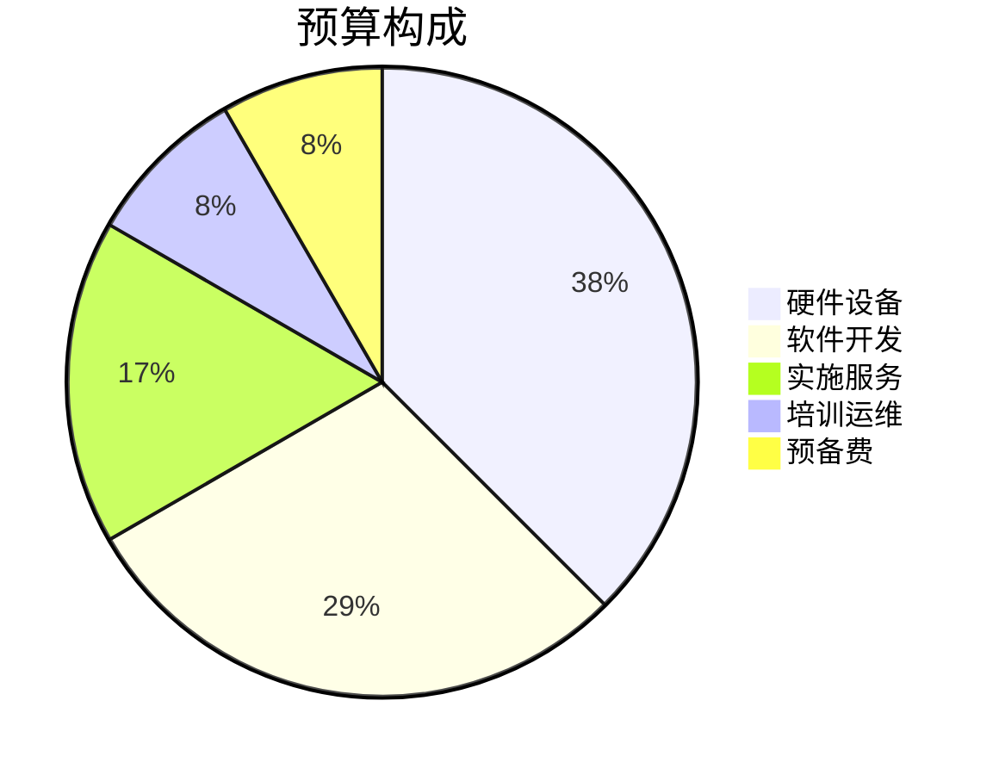
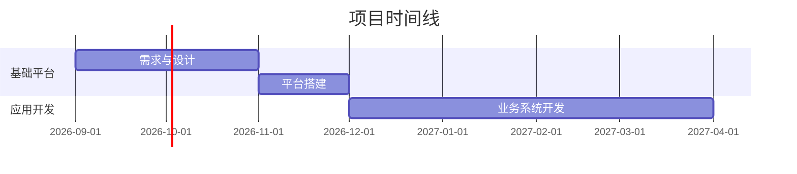

# 场景1：项目启动

# 场景1：项目启动

## 触发方式

用户说出类似指令：
- "根据这些材料，帮我把项目初始化出来"
- "帮我启动XX项目"
- "帮我创建XX项目"

## 输入形式

- 用户自然语言描述项目目标
- 工作区中的项目文档（用户告知路径）
- 文档格式：Markdown 或纯文本文件，通过 `read_file` 读取

## 工作流程

### 步骤1：读取项目资料

1. 确认用户提供的文档路径
2. 逐个读取文档，提取关键信息
3. 如果用户未提供明确路径，询问文档位置

### 步骤2：分析项目信息

从文档中提取以下内容，展示给用户确认：

**项目基础信息卡：**
- 项目名称
- 项目类型
- 建设目标
- 建设范围
- 建设周期
- 项目地点
- 参与单位

**项目组织信息：**
- 建设单位
- 项目负责人
- 参与部门
- 外部协作单位

**项目约束条件：**
- 时间要求
- 合同约束
- 关键审批节点
- 重要风险因素

### 步骤3：生成项目启动方案

在用户确认分析结果后，生成完整的项目启动方案，使用以下格式展示：

````markdown
# 🚀 项目启动方案

## 📋 项目信息卡

| 项目名称 | {项目名称} |
|---------|-----------|
| 项目类型 | {类型} |
| 建设周期 | {起止时间} |
| 总投资 | {预算} |
| 项目负责人 | {姓名} |
| 建设单位 | {单位} |

## 🎯 项目目标

1. {目标1}
2. {目标2}
3. {目标3}

## 📊 项目阶段规划


| 阶段 | 时间 | 目标 | 交付物 |
|-----|------|------|--------|
| 启动阶段 | {时间} | {目标} | {交付物} |
| 设计阶段 | {时间} | {目标} | {交付物} |
| ... | ... | ... | ... |

## 📝 任务分解

### 任务1：{任务名称}
- **负责人**：{角色}
- **工期**：{天数}天
- **前置任务**：{前置}
- **交付物**：{交付物}

### 任务2：{任务名称}
- ...

## ⚠️ 初始风险识别

| 编号 | 风险类型 | 风险描述 | 影响 | 概率 | 应对措施 |
|------|---------|---------|------|------|---------|
| R1 | {类型} | {描述} | 高 | 中 | {措施} |
| R2 | ... | ... | ... | ... | ... |

## 📁 项目知识空间

```
项目名称/
├── 01-项目立项/
├── 02-项目计划/
├── 03-设计方案/
├── 04-项目执行/
├── 05-会议纪要/
├── 06-技术资料/
├── 07-验收资料/
└── 08-项目经验/
```
````

### 步骤4：用户确认

展示方案后，等待用户指令：
- **确认创建** → 执行步骤5
- **调整方案** → 根据反馈修改后重新展示
- **重新生成** → 回到步骤1

### 步骤5：创建项目文件

用户确认后，执行：

1. 创建项目根目录（在用户工作区内）
2. 按推荐结构创建子目录
3. 创建 `README.md` — 项目总览
4. 创建 `plan.md` — 项目计划
5. 创建 `tasks.md` — 任务清单
6. 创建 `risks.md` — 风险登记册
7. 创建 `project-data.json` — 结构化项目数据

### 步骤6：生成结构化数据

创建 `project-data.json`，格式如下：

```json
{
  "projectName": "项目名称",
  "projectCode": "PRJ-{年份}-{序号}",
  "status": "initiated",
  "startDate": "开始日期",
  "endDate": "结束日期",
  "budget": 预算金额,
  "objectives": ["目标1", "目标2"],
  "phases": [
    {
      "name": "阶段名称",
      "start": "开始日期",
      "end": "结束日期",
      "deliverables": ["交付物1"]
    }
  ],
  "tasks": [
    {
      "id": "TASK-001",
      "name": "任务名称",
      "assignee": "负责人角色",
      "estimate": 工期天数,
      "dependencies": []
    }
  ],
  "risks": [
    {
      "id": "RISK-001",
      "type": "风险类型",
      "description": "风险描述",
      "level": "高/中/低",
      "mitigation": "应对措施"
    }
  ],
  "team": [
    {
      "role": "角色",
      "name": "姓名",
      "department": "部门"
    }
  ]
}
```

## 输出格式要求

### 整体风格
所有输出使用以下格式，按顺序展示：

### 1. 🚀 项目启动方案（标题）

━━━━━━━━━━━━━━━━━━━━━━━━━━━━━━━━━━━━━━━

### 2. 📊 执行摘要面板

一行展示核心指标（用表格或分隔的短卡片）：

| 项目名称 | 项目周期 | 总投资 | 负责人 | 风险等级 |
|---------|---------|-------|-------|---------|
| 智慧园区... | 12个月 | ¥1,200万 | 张明 | 🟡 中等 |

### 3. 🎯 项目目标

3-5 条关键目标，每条前加 Emoji。

### 4. 🗺️ 阶段规划流程图

使用 Mermaid 流程图（` ```mermaid` 代码块）：


### 5. 💰 预算构成（可选）

用 Mermaid 饼图：



### 6. 📅 时间线规划

用 Mermaid 甘特图：



### 7. 📋 阶段详情

每个阶段用卡片式展示，含 Mermaid 进度条（可选）：

```
### 🏗️ 阶段一：基础平台建设（第1-3月）
- **目标**：完成需求确认与方案设计
- **交付物**：需求规格说明书、系统设计方案
```

### 8. 📝 任务分解

用树形结构，每项含负责人、工期、前置任务。

### 9. ⚠️ 风险识别

用表格，风险等级用颜色标签：
- 🔴 高风险 / 🟡 中风险 / 🟢 低风险

### 10. 📁 项目知识空间

用树形目录结构。

### 11. ⚡ 下一步行动

用 checkbox 清单：

```
- [ ] 确认项目信息卡内容
- [ ] 制定详细工作计划
- [ ] 创建项目工作空间
```

### 12. 💡 AI 提示（可选）

```
> 💡 **提示**：创建项目后，你可以随时对我说"帮我跟踪项目进度"或"生成项目周报"。
```

## 演示确认清单

输出完成后，人工核对以下内容是否存在：
- [ ] 执行摘要面板（表格形式）
- [ ] 项目目标列表
- [ ] Mermaid 阶段流程图（渲染为图形）
- [ ] Mermaid 预算饼图（可选）
- [ ] Mermaid 甘特图（可选）
- [ ] 阶段详情卡片
- [ ] 任务分解
- [ ] 风险识别清单（含颜色标签）
- [ ] 项目目录结构
- [ ] 下一步行动 checkbox 清单
- [ ] project-data.json
- [ ] 用户确认环节