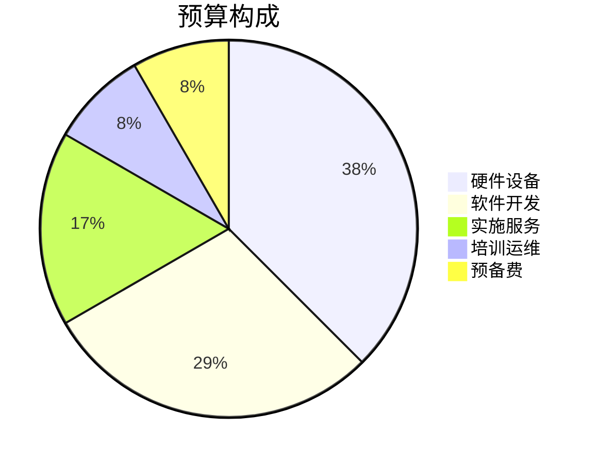
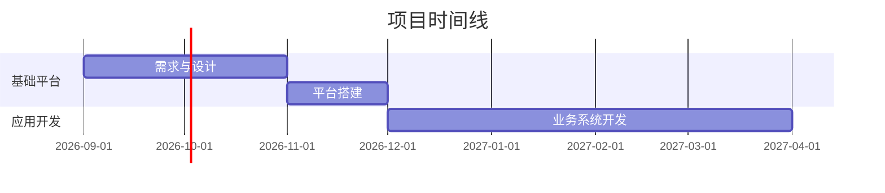

# 场景1：项目启动

# 场景1：项目启动

## Demo 演示模式

**Demo 模式下，彻底跳过步骤1和步骤2，不进行任何文件探索、目录检查、git 检查、模板仓库检查。直接走步骤3。**

**硬性禁止：**

| 禁止操作 | 原因 |
|----------|------|
| 加载 `visualize` 技能 | 它是系统级工具，已可用，无需加载 |
| 读取 `design.md`、`charts.md` 等参考文件 | 不需要 |
| 加载其他技能（如 `init-view-starlight-*`） | 与项目启动无关 |
| 探索工作区目录、git 检查 | 浪费时间 |
| 输出冗长 Think 推理 | 影响演示效果 |

**只允许以下操作：**

1. `read_file` 读取 `demo-data.json`（唯一数据源）
2. 生成方案摘要 + Mermaid 图表
3. `visualize(title, fragment, mode="wide")` 渲染卡片
4. 格式选择 + 生成文件

**Demo 模式完整流程（仅3步）：**
- 读 demo-data.json → 步骤3（方案 + 卡片） → 步骤4（格式选择 + 生成文件）

## 触发方式

用户说出类似指令：
- "根据这些材料，帮我把项目初始化出来"
- "帮我启动XX项目"
- "帮我创建XX项目"

## 输入形式

- 用户自然语言描述项目目标
- 工作区中的项目文档（用户告知路径）
- 支持格式：
  - `.md` / `.txt` — 直接通过 `read_file` 读取
  - `.docx` — 通过 `run_command` 调用 `read-docs.ts` 提取文字
  - `.xlsx` — 通过 `run_command` 调用 `read-docs.ts` 提取表格内容
  - `.pdf` — 通过 `run_command` 调用 `read-docs.ts` 混合处理：
    - 文本型 PDF → `pdftotext` 提取文字
    - 扫描件(≤5页) → 输出图片路径，调用视觉模型读取
    - 扫描件(>5页) → `tesseract` OCR 提取文字

## 工作流程

### 步骤1：读取项目资料

**Demo 模式**：直接从 `{preset_dir}/skills/scenario-1-project-launch/demo-data.json` 加载固定项目数据，跳过文档读取步骤。

**正常模式**：

1. 确认用户提供的文档路径
2. 根据文件扩展名选择读取方式：
   - `.md` / `.txt` → 直接 `read_file` 读取
   - `.docx` / `.xlsx` → 运行 `npx tsx {preset_dir}/scripts/read-docs.ts --input {path}`，输出为文字内容
   - `.pdf` → 运行 `npx tsx {preset_dir}/scripts/read-docs.ts --input {path}`：
     - 输出为纯文本 → 直接读取
     - 输出包含 `IMAGE:` 前缀 → 扫描件，将图片传给视觉模型识别
3. 逐个读取文档后，向用户展示提取到的关键信息摘要
4. 如果用户未提供明确路径，询问文档位置

### 步骤2：分析项目信息

**Demo 模式**：跳过此步骤，直接进入步骤3。

**正常模式**：

从文档中提取以下内容，展示给用户确认：

**项目基础信息卡：**
- 项目名称
- 项目类型
- 建设目标
- 建设范围
- 建设周期
- 项目地点
- 参与单位

**项目组织信息：**
- 建设单位
- 项目负责人
- 参与部门
- 外部协作单位

**项目约束条件：**
- 时间要求
- 合同约束
- 关键审批节点
- 重要风险因素

### 步骤3：生成方案并渲染交互确认卡片

**一次性完成以下操作，不分步：**

1. 输出完整的项目启动方案（含以下内容）
2. 同步创建 `project-data.json`
3. 调用 `visualize` 工具渲染交互确认卡片
4. 卡片即确认工具，**不再弹文字确认**

**输出顺序：**
- 先展示方案摘要 + Mermaid 图表
- 方案末尾加入入口提示：`> ✏️ 请在下方卡片中编辑确认方案，修改完成后点击「确认提交」`
- 紧接着渲染 visualize 卡片（双栏布局，自动展开）
- 用户提交后，粘贴 JSON 回复，AI 读取后更新 `project-data.json`，执行步骤4

````markdown
# 🚀 项目启动方案

## 📋 项目信息卡

| 项目名称 | {项目名称} |
|---------|-----------|
| 项目类型 | {类型} |
| 建设周期 | {起止时间} |
| 总投资 | {预算} |
| 项目负责人 | {姓名} |
| 建设单位 | {单位} |

## 🎯 项目目标

1. {目标1}
2. {目标2}
3. {目标3}

## 📊 项目阶段规划


| 阶段 | 时间 | 目标 | 交付物 |
|-----|------|------|--------|
| 启动阶段 | {时间} | {目标} | {交付物} |
| 设计阶段 | {时间} | {目标} | {交付物} |
| ... | ... | ... | ... |

## 📝 任务分解

### 任务1：{任务名称}
- **负责人**：{角色}
- **工期**：{天数}天
- **前置任务**：{前置}
- **交付物**：{交付物}

### 任务2：{任务名称}
- ...

## ⚠️ 初始风险识别

| 编号 | 风险类型 | 风险描述 | 影响 | 概率 | 应对措施 |
|------|---------|---------|------|------|---------|
| R1 | {类型} | {描述} | 高 | 中 | {措施} |
| R2 | ... | ... | ... | ... | ... |

## 📁 项目知识空间

```
项目名称/
├── 01-项目立项/
├── 02-项目计划/
├── 03-设计方案/
├── 04-项目执行/
├── 05-会议纪要/
├── 06-技术资料/
├── 07-验收资料/
└── 08-项目经验/
```
````

**visualize 卡片调用：**

```bash
# 1. 读取 demo-data.json
# 2. 运行脚本生成 HTML 片段（双栏布局 + 日期选择器 + 模态确认）
#    脚会输出完整 HTML 片段到 stdout
npx tsx {preset_dir}/scripts/generate-confirm-fragment.ts \
  --input {preset_dir}/skills/scenario-1-project-launch/demo-data.json
```

```javascript
// 3. 将脚本输出的 HTML 片段作为 fragment 传给 visualize
//    fragment 内容由脚本生成，AI 不需要手写 HTML
visualize({
  title: "项目方案确认",
  fragment: "<脚本输出的 HTML 片段>",
  mode: "wide"
})
```

用户提交卡片数据后，JSON 自动填入对话输入框，用户按 Enter 发送即可。AI 读取后更新 `project-data.json`，执行步骤4。

### 步骤4：选择输出格式并创建项目文件

用户确认方案后，**先询问输出格式**：

**请问您希望生成什么格式的文件？**
- **Word + Excel（推荐）**：生成 `项目启动方案.docx` 和 `项目任务清单.xlsx`，适合非技术人员审阅
- **Markdown**：生成 `README.md`、`plan.md`、`tasks.md`、`risks.md`，适合开发人员编辑
- **全部都要**：同时生成 Word、Excel 和 Markdown 格式

**注意：每种格式使用固定模板生成，不会随意调整内容结构。**

用户选择格式后，执行：

1. 创建项目根目录（在用户工作区内）
2. 创建 `project-data.json` — 结构化项目数据（格式见下方模板）
3. 运行脚本生成文档（脚本自动创建完整目录结构和所有文件）：
   ```
   npx tsx {preset_dir}/scripts/generate-docs.ts \
     --format <word|excel|md|all> \
     --input {project_dir}/project-data.json \
     --output {project_dir}
   ```
   其中 `{preset_dir}` 为技能文件所在目录的上级目录，`{project_dir}` 为项目根目录
4. 生成完成后，在对话中告知用户文件结构

### 步骤5：生成结构化数据

创建 `project-data.json`，格式如下：

```json
{
  "projectName": "项目名称",
  "projectCode": "PRJ-{年份}-{序号}",
  "status": "initiated",
  "startDate": "开始日期",
  "endDate": "结束日期",
  "budget": 预算金额,
  "objectives": ["目标1", "目标2"],
  "phases": [
    {
      "name": "阶段名称",
      "start": "开始日期",
      "end": "结束日期",
      "deliverables": ["交付物1"]
    }
  ],
  "tasks": [
    {
      "id": "TASK-001",
      "name": "任务名称",
      "assignee": "负责人角色",
      "estimate": 工期天数,
      "dependencies": []
    }
  ],
  "risks": [
    {
      "id": "RISK-001",
      "type": "风险类型",
      "description": "风险描述",
      "level": "高/中/低",
      "mitigation": "应对措施"
    }
  ],
  "team": [
    {
      "role": "角色",
      "name": "姓名",
      "department": "部门"
    }
  ]
}
```

## 输出格式要求

### 整体风格
所有输出使用以下格式，按顺序展示：

### 1. 🚀 项目启动方案（标题）

━━━━━━━━━━━━━━━━━━━━━━━━━━━━━━━━━━━━━━━

### 2. 📊 执行摘要面板

一行展示核心指标（用表格或分隔的短卡片）：

| 项目名称 | 项目周期 | 总投资 | 负责人 | 风险等级 |
|---------|---------|-------|-------|---------|
| 智慧园区... | 12个月 | ¥1,200万 | 张明 | 🟡 中等 |

### 3. 🎯 项目目标

3-5 条关键目标，每条前加 Emoji。

### 4. 🗺️ 阶段规划流程图

使用 Mermaid 流程图（` ```mermaid` 代码块）：


### 5. 💰 预算构成（可选）

用 Mermaid 饼图：



### 6. 📅 时间线规划

用 Mermaid 甘特图：



### 7. 📋 阶段详情

每个阶段用卡片式展示，含 Mermaid 进度条（可选）：

```
### 🏗️ 阶段一：基础平台建设（第1-3月）
- **目标**：完成需求确认与方案设计
- **交付物**：需求规格说明书、系统设计方案
```

### 8. 📝 任务分解

用树形结构，每项含负责人、工期、前置任务。

### 9. ⚠️ 风险识别

用表格，风险等级用颜色标签：
- 🔴 高风险 / 🟡 中风险 / 🟢 低风险

### 10. 📁 项目知识空间

用树形目录结构。

### 11. ⚡ 下一步行动

用 checkbox 清单：

```
- [ ] 确认项目信息卡内容
- [ ] 制定详细工作计划
- [ ] 创建项目工作空间
```

### 12. 💡 AI 提示（可选）

```
> 💡 **提示**：创建项目后，你可以随时对我说"帮我跟踪项目进度"或"生成项目周报"。
```

## 固定模板说明

生成的文件使用固定模板，内容结构不可随意调整：

### Word 模板（`项目启动方案.docx`）

| 板块 | 内容 |
|------|------|
| 封面 | 项目名称、项目编号、项目状态 |
| 项目信息卡 | 项目名称、编号、状态、起止日期、总投资 |
| 项目目标 | 逐条列出 |
| 阶段规划 | 表格：阶段名称、开始时间、结束时间、交付物 |
| 任务分解 | 逐条列出：任务编号、名称、负责人、工期、前置任务 |
| 风险识别 | 表格：编号、风险类型、风险描述、影响等级、应对措施 |

### Excel 模板（`项目任务清单.xlsx`）

| 工作表 | 列 |
|--------|----|
| 任务清单 | 编号、任务名称、负责人、工期(天)、前置任务 |
| 风险登记册 | 编号、风险类型、风险描述、影响等级、应对措施 |
| 项目摘要 | 项目名称、编号、状态、起止日期、总投资、目标、团队 |

### Markdown 模板

| 文件 | 内容 |
|------|------|
| `README.md` | 项目总览、目标、团队、阶段规划 |
| `plan.md` | 项目计划、基本信息、阶段规划 |
| `tasks.md` | 任务清单表格 |
| `risks.md` | 风险登记册表格 |

## 演示确认清单

输出完成后，人工核对以下内容是否存在：
- [ ] 执行摘要面板（表格形式）
- [ ] 项目目标列表
- [ ] Mermaid 阶段流程图（渲染为图形）
- [ ] Mermaid 预算饼图（可选）
- [ ] Mermaid 甘特图（可选）
- [ ] 阶段详情卡片
- [ ] 任务分解
- [ ] 风险识别清单（含颜色标签）
- [ ] 项目目录结构
- [ ] 下一步行动 checkbox 清单
- [ ] project-data.json
- [ ] 用户确认环节