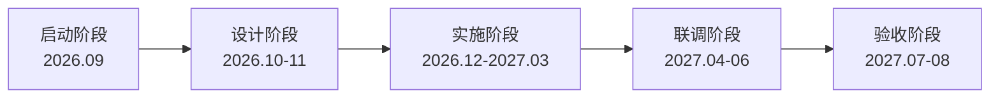
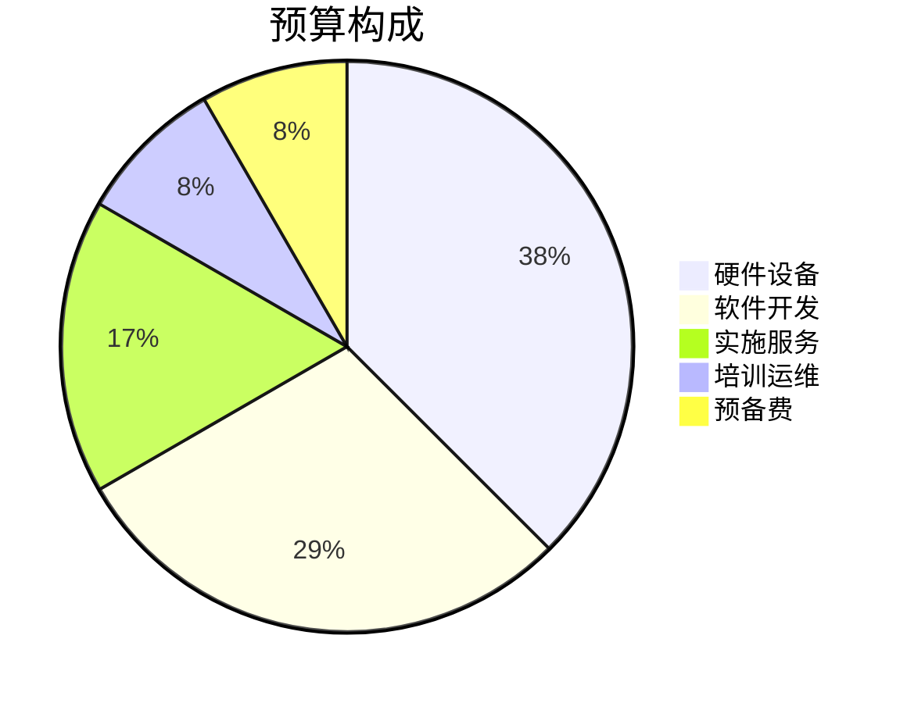
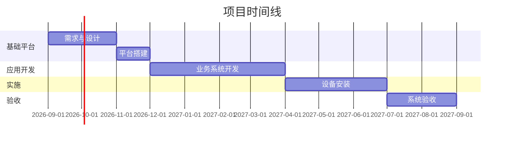

# 场景1：一句话启动一个项目 — 演示脚本

## 操作步骤

### 1. 准备工作
- 选择预设：「项目智脑」
- 确保工作区在项目根目录

### 2. 向 AI 输入
```
根据这些材料，帮我把项目初始化出来。
```

### 3. AI 输出内容

AI 将依次展示以下内容。每一步需要人工确认。

#### 步骤 3.1 — 项目信息分析摘要

AI 从文档中提取关键信息，以表格形式展示。

#### 步骤 3.2 — 项目启动方案

AI 展示完整方案，包含以下板块：

| 板块 | 展示形式 | 说明 |
|------|---------|------|
| 项目信息卡 | 表格 | 项目名称、类型、周期、预算、负责人 |
| 项目目标 | 列表 | 3-5 条关键目标 |
| 阶段规划 | Mermaid 流程图 + 表格 | 阶段名称、时间、目标、交付物 |
| 任务分解 | 分级列表 | 每项含负责人、工期、前置任务 |
| 风险识别 | 表格 | 风险类型、描述、影响、概率、应对措施 |
| 知识空间 | 树形目录 | 项目目录结构 |

#### 步骤 3.3 — 等待用户确认

AI 展示方案后，会等待用户确认。

#### 步骤 3.4 — 创建项目文件（确认后）

确认后，AI 创建以下文件：

```
智慧园区建设项目/
├── README.md
├── plan.md
├── tasks.md
├── risks.md
└── project-data.json
```

## 预期输出示例

### 📊 执行摘要

| 项目名称 | 项目周期 | 总投资 | 负责人 | 风险等级 |
|---------|---------|-------|-------|---------|
| 智慧园区一体化管理平台 | 12个月 | ¥1,200万 | 张明 | 🟡 中等 |

### 🗺️ 阶段规划流程图



### 💰 预算构成



### 📅 时间线规划



### 📋 阶段详情

| 阶段 | 时间 | 目标 | 交付物 |
|-----|------|------|--------|
| 启动阶段 | 2026-09 | 完成立项与团队组建 | 项目章程 |
| 设计阶段 | 2026-10~11 | 完成方案设计 | 设计方案 |
| 采购实施 | 2026-12~2027-03 | 完成采购与开发 | 采购合同、系统原型 |
| 施工建设 | 2027-04~06 | 完成安装与联调 | 安装报告 |
| 验收交付 | 2027-07~08 | 完成验收 | 验收报告 |

### ⚠️ 风险识别

| 编号 | 风险类型 | 风险描述 | 影响 | 应对措施 |
|------|---------|---------|------|---------|
| R1 | 🔴 技术 | 子系统接口标准不统一 | 高 | 提前制定接口规范 |
| R2 | 🔴 供应链 | 关键设备采购周期长 | 高 | 提前确认供应商 |
| R3 | 🟡 管理 | 涉及部门多，协调成本高 | 中 | 建立例会制度 |
| R4 | 🟢 进度 | 工期紧张 | 中 | 设置质量检查点 |

### ⚡ 下一步行动

- [ ] 确认项目信息卡内容
- [ ] 指定各阶段负责人
- [ ] 制定详细工作计划
- [ ] 创建项目工作空间

> 💡 **提示**：创建项目后，你可以随时对我说"帮我跟踪项目进度"或"生成项目周报"。 |

## 核对清单

- [ ] AI 读取了示例项目资料中的文档
- [ ] 项目信息卡以表格形式展示
- [ ] 含 Mermaid 阶段流程图
- [ ] 阶段规划表完整
- [ ] 任务分解含负责人和工期
- [ ] 风险清单含类型和应对措施
- [ ] 展示方案后等待用户确认
- [ ] 确认后创建了项目文件
- [ ] 输出了 `project-data.json` 结构化数据